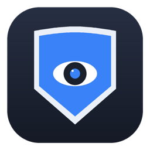

<p align="center">
  
</p>

<h1 align="center">SpyProtect</h1>

<p align="center">
  <a href="../../actions/workflows/lint.yml"></a>
  <a href="../../actions/workflows/ci.yml"></a>
  <a href="../../actions/workflows/release.yml"></a>
  <a href="../../actions/workflows/ci.yml"></a>
</p>

A macOS menu bar app that watches for activity while your screen is locked, so you know
if anyone tried to get in while you were away.

## What it logs

- **Failed unlock attempts** (with a webcam snapshot of whoever tried)
- **USB devices connecting/disconnecting**, with keyboard/HID-class devices flagged
  separately (the class code keystroke-injection "BadUSB" attacks impersonate)
- **Apps launched** while the screen was locked

Everything is scoped to the actual locked→unlocked window - nothing is logged while
you're using the machine normally. A real-time notification fires per event, plus one
summary notification when you unlock if anything happened.

It also includes a **Security Check** (right-click the menu bar icon) that audits
FileVault, the Guest account, Firewall, Remote Login, and Screen Sharing, and flags a few
other settings (Startup Security, lock-screen notification previews, AirDrop) that are
worth checking manually since they can't be read reliably from the command line.

## Installing a release build

1. Download `SpyProtect.zip` from the [Releases](../../releases) page and unzip it.
2. **This build is not notarized or signed with an Apple Developer ID**, so Gatekeeper
   will block it. On recent macOS, a plain right-click → Open often doesn't even offer
   an override - you may just see:

   > "Apple could not verify 'SpyProtect.app' is free of malware..."

   Two ways past it (only needed once):

   - **Terminal** (fastest): remove the quarantine flag the download attached -
     ```bash
     xattr -cr ~/Downloads/SpyProtect.app
     ```
     (adjust the path if you unzipped it somewhere else), then open it normally.
   - **System Settings**: after the block, open System Settings → Privacy & Security →
     scroll down to *"SpyProtect.app" was blocked to protect your Mac* → **Open Anyway**,
     then confirm once more when it launches.
3. On first launch, macOS will ask for **Notification** and **Camera** permission -
   both are needed for the core features (alerts, and the failed-unlock snapshot). It
   will also ask once whether to start automatically at login - you can change that
   answer anytime from the right-click menu ("Start at Login").
4. Move it to `/Applications` if you want it to stick around.

## Updates

The right-click menu has **Check for Updates…** for a manual check, and an
**Automatically Check for Updates** toggle (on by default) that checks once a day in the
background and only shows a notification if something newer is actually available -
routine checks that find nothing stay silent.

This works by querying GitHub's public releases API, which means it only functions once
this repository is **public**. While it's private, both the manual and automatic checks
fail gracefully with a "repository may still be private" message instead of erroring.

## Building from source

Requires Xcode (for the macOS SDK) and its command-line tools.

```bash
git clone <this repo>
cd SpyProtect
./build_app.sh release
open SpyProtect.app
```

`./build_app.sh` (no argument) builds a debug binary for local iteration;
`./build_app.sh release` builds an optimized release build - both produce
`SpyProtect.app` in the project root, ad-hoc signed so macOS treats it as a real app
(own entry in Notification settings, stable TCC identity across relaunches, etc.).

## Running tests

```bash
swift test
```

The coverage badge above reflects line coverage of the whole codebase, including the
SwiftUI/AppKit views and the IOKit/AVFoundation hardware-interfacing code (USB
detection, camera capture) that isn't practically unit-testable - so it's expected to
sit well under 100%. The parts that matter most for correctness - event storage,
session categorization, the lock-state gating that decides when the camera/notifications
are allowed to fire, security checks, and update checking - are the ones actually covered
by `Tests/SpyProtectTests`. CI regenerates this badge on every push to `main`, and (like
the other badges) it only renders once this repository is public.

## Privacy notes

- Snapshots and event history are stored locally only, under
  `~/Library/Application Support/SpyProtect/` - nothing leaves the machine.
- The camera only activates for about a second per failed unlock attempt; it is not
  continuously recording.
- "Clear All Logs" in the right-click menu wipes stored history at any time.
- Sessions and their snapshot photos are **automatically deleted after 30 days** - checked
  once on launch and once every 24 hours while the app keeps running. This keeps history
  from growing forever on a machine that stays logged in for months.
